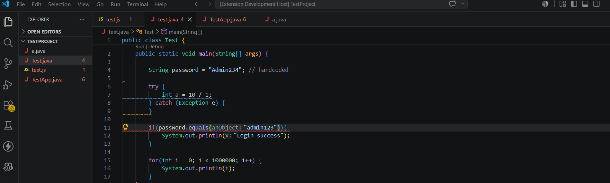
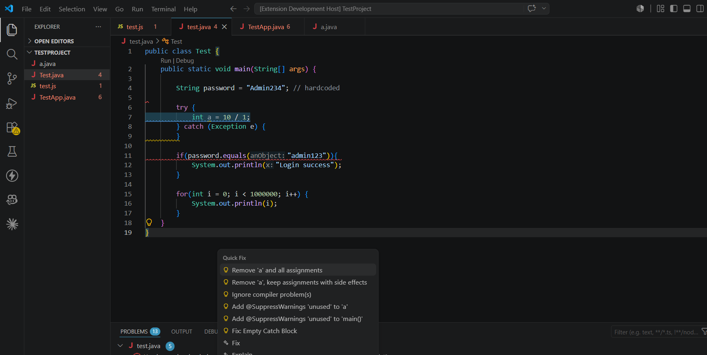
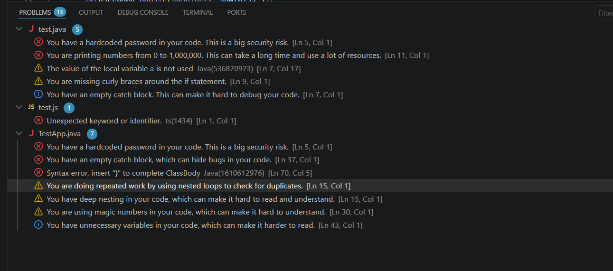

<div align="center">
  <h1>CodeCritiq</h1>
  <p>
    <strong>An AI-powered VS Code extension that reviews your code in real-time, detects bugs, suggests fixes, and learns from your mistakes.</strong>
  </p>
  <p>
    <a href="https://github.com/Krishna11-cell/ai-pair-programmer/issues">
      
    </a>
    <a href="https://github.com/Krishna11-cell/ai-pair-programmer/blob/main/LICENSE">
      
    </a>
    <a href="https://github.com/Krishna11-cell/ai-pair-programmer">
      
    </a>
    <a href="https://github.com/Krishna11-cell/ai-pair-programmer/actions/workflows/ci.yml">
      
    </a>
    <a href="https://code.visualstudio.com/api">
      
    </a>
  </p>
</div>

---

## Overview

**CodeCritiq** is a VS Code extension that acts as your automated code review partner. Built with **Groq's LLM (llama-3.3-70b-versatile)** and **Babel AST parsing**, it:

- Analyzes your code **automatically on every save**
- Detects **bugs, performance issues, security risks, readability problems, and architectural flaws**
- Provides **inline diagnostics** (underlines) with severity-coded warnings
- Offers **hover explanations** with why-it-matters and how-to-fix instructions
- Delivers **one-click Quick Fixes** (Ctrl+.) with AI-generated fixed code
- **Remembers past mistakes** using a vector similarity store to flag repeated issues

---

## Features

### 🔍 Automated Code Review on Save
Every time you save a file, the extension triggers a multi-layer review pipeline:

```
AST Static Analysis → Memory Recall → AI LLM Review → Merge → Display
```

### 📋 Multi-Layer Detection

| Layer | Technology | What It Catches |
|---|---|---|
| **Static Regex** | Pattern matching | `var`, `console.log`, `TODO`, empty `catch`, `eval()`, hardcoded secrets |
| **AST Analysis** | Babel parser + traverse | Long functions, empty functions, deep nesting, loose equality, `any` type, `var` |
| **AI Review** | Groq llama-3.3-70b | Bugs, logic errors, performance, security, bad practices |
| **Memory** | Vector similarity (cosine) | Repeat offenses flagged with high severity |

### 💡 Inline Diagnostics
Errors and warnings appear as colored underlines in your editor:
- 🔴 **High severity** (Error) — security risks, repeat offenses
- 🟡 **Medium severity** (Warning) — bugs, architecture issues
- 🔵 **Low severity** (Information) — style, readability tips

### 🖱️ Hover Explanations
Hover over any flagged line to see:
- Issue title and explanation
- Why it matters in real-world terms
- Step-by-step fix instructions
- AI-generated fixed code snippet

### ⚡ One-Click Quick Fixes
Hit `Ctrl+.` (or `Cmd+.` on macOS) on a flagged line to apply the AI-suggested fix automatically.

### 🧠 Persistent Memory
The extension stores issues in a vector database (`data/memory.json`) and retrieves similar past mistakes to:
- Flag repeated problems with **high severity**
- Inject past context into AI prompts for smarter reviews

### 🌐 Multi-Language Support
Active for: **JavaScript, TypeScript, Python, Java, C++, C**

---

## Tech Stack

| Layer | Technology |
|---|---|
| **Extension Host** | VS Code API (v1.110+) |
| **Language** | TypeScript (ES2022) |
| **AI/LLM** | Groq SDK — `llama-3.3-70b-versatile` |
| **AST Parsing** | Babel (`@babel/parser`, `@babel/traverse`) |
| **Memory Store** | Custom vector store with cosine similarity |
| **Debouncing** | Lodash |
| **Environment** | dotenv |
| **Build** | TypeScript Compiler (`tsc`) |
| **Lint** | ESLint + typescript-eslint |
| **Test** | Mocha (VS Code Test CLI) |

---

## Screenshots

### Code Review in Action


### Hover Explanation


### Quick Fix (Ctrl+.)


### Diagnostics Overview


---

## Architecture

```
┌─────────────────────────────────────────────────────────┐
│                    VS Code Extension Host               │
│                                                         │
│  ┌──────────────────────────────────────────────────┐   │
│  │              extension.ts (Entry Point)          │   │
│  │  ┌──────────────┐  ┌───────────────────────────┐ │   │
│  │  │ Save Listener │  │  Debounce Map (1.5s/file) │ │   │
│  │  └──────┬───────┘  └───────────────────────────┘ │   │
│  └─────────┼─────────────────────────────────────────┘   │
│            │                                             │
│  ┌─────────▼─────────────────────────────────────────┐   │
│  │              core/reviewer.ts (Pipeline)          │   │
│  │                                                   │   │
│  │  ┌──────────┐  ┌──────────┐  ┌────────────────┐  │   │
│  │  │AST       │  │Memory    │  │LLM Client      │  │   │
│  │  │Analyzer  │  │Manager   │  │(Groq API)      │  │   │
│  │  │(Babel)   │  │(Vector   │  │llama-3.3-70b   │  │   │
│  │  │          │  │ Store)   │  │                │  │   │
│  │  └─────┬────┘  └────┬─────┘  └───────┬────────┘  │   │
│  │        └────────────┼────────────────┘            │   │
│  │                     ▼                             │   │
│  │           mergeIssues() (Deduplicate)             │   │
│  │                     │                             │   │
│  │                     ▼                             │   │
│  │           Store high-severity to memory           │   │
│  └─────────────────────┼─────────────────────────────┘   │
│                        │                                 │
│  ┌─────────────────────▼─────────────────────────────┐   │
│  │              Display Layer                        │   │
│  │  ┌────────────────┐  ┌──────────────┐  ┌───────┐ │   │
│  │  │ diagnostics.ts │  │hoverProvider │  │Code   │ │   │
│  │  │ (Underlines)   │  │ (Explanations)│  │Action │ │   │
│  │  └────────────────┘  └──────────────┘  │Provider│ │   │
│  │                                        │(Ctrl+.)│ │   │
│  │                                        └────────┘ │   │
│  └──────────────────────────────────────────────────┘   │
└─────────────────────────────────────────────────────────┘
```

---

## Installation

### Prerequisites
- [VS Code](https://code.visualstudio.com/) v1.110.0 or higher
- [Node.js](https://nodejs.org/) 18+
- A [Groq API key](https://console.groq.com/) (free tier available)

### Steps

1. **Clone the repository**
   ```bash
   git clone https://github.com/Krishna11-cell/ai-pair-programmer.git
   cd ai-pair-programmer
   ```

2. **Install dependencies**
   ```bash
   npm install
   ```

3. **Configure your API key**
   ```bash
   cp .env.txt .env
   ```
   Then edit `.env` and add your Groq API key:
   ```
   GROQ_API_KEY=gsk_your_api_key_here
   ```

4. **Compile the extension**
   ```bash
   npm run compile
   ```

5. **Run in VS Code**
   - Press `F5` to open a new Extension Development Host window
   - Open any supported file (`.js`, `.ts`, `.py`, `.java`, `.cpp`, `.c`)
   - Save the file to trigger a review

---

## Usage

### Triggering a Review
Reviews happen **automatically on save**. The extension:
1. Shows `AI reviewing code...` in the status bar
2. After analysis, shows `AI Review complete — N issue(s) found`
3. Underlines issues inline with color-coded diagnostics

### Viewing Issues
- **Red underline** = High severity (security, repeat offenses)
- **Yellow underline** = Medium severity (bugs, architecture)
- **Blue underline** = Low severity (style, readability)

### Getting Fixes
1. **Hover** over any underlined line for explanation + fix instructions
2. Press `Ctrl+.` (or `Cmd+.`) to open Quick Fix menu
3. Select `Fix: ...` to apply AI-generated fixed code automatically

---

## Development

### Project Structure
```
src/
├── extension.ts              # Entry point, activation, save listener
├── diagnostics.ts            # VS Code diagnostics collection manager
├── codeActionProvider.ts     # Quick Fix provider (Ctrl+.)
├── analysis/
│   └── astAnalyzer.ts        # Babel AST static analysis (7 rules)
├── core/
│   └── reviewer.ts           # Main review pipeline orchestrator
├── hover/
│   └── hoverProvider.ts      # Hover explanations from AI
├── llm/
│   └── llmClient.ts          # Groq LLM API client
├── memory/
│   ├── embedding.ts          # Character-code hash embeddings
│   ├── memoryManager.ts      # Memory CRUD operations
│   └── vectorStore.ts        # Cosine similarity vector search
└── test/
    └── extension.test.ts     # Mocha test suite
```

### Scripts
| Command | Description |
|---|---|
| `npm run compile` | Compile TypeScript to `out/` |
| `npm run watch` | Watch mode for development |
| `npm run lint` | Lint all source files |
| `npm test` | Run VS Code extension tests |
| `npm run vscode:prepublish` | Build before publishing |

---

## Roadmap

### v1.0 — Current
- [x] AST static analysis (7 rules)
- [x] AI-powered code review via Groq
- [x] Inline diagnostics with severity colors
- [x] Hover explanations
- [x] One-click Quick Fixes
- [x] Persistent memory vector store

### v1.1 — Upcoming
- [ ] Support for more languages (Go, Rust, Ruby)
- [ ] Custom rule configuration via VS Code settings
- [ ] Review history panel
- [ ] Performance improvements for large files

### v2.0 — Future
- [ ] Code generation from natural language comments
- [ ] Team collaboration features
- [ ] CI/CD integration (GitHub Actions)
- [ ] Test generation
- [ ] Voice-controlled interactions

---

## Contributing

Contributions are welcome! Please see [CONTRIBUTING.md](CONTRIBUTING.md) for guidelines.

1. Fork the repository
2. Create a feature branch (`git checkout -b feature/amazing-feature`)
3. Commit your changes (`git commit -m 'Add amazing feature'`)
4. Push to the branch (`git push origin feature/amazing-feature`)
5. Open a Pull Request

---

## License

Distributed under the MIT License. See [LICENSE](LICENSE) for more information.

---

## Contact

Project Link: [https://github.com/Krishna11-cell/ai-pair-programmer](https://github.com/Krishna11-cell/ai-pair-programmer)

---

<div align="center">
  <sub>Built with ❤️ using TypeScript, Groq AI, and VS Code API</sub>
</div>
